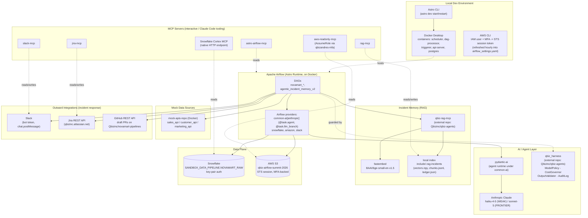

# NovaMart Pipelines — Tech Stack

Mermaid diagram of the stack behind this project. Render with any Mermaid-compatible tool
(GitHub/GitLab markdown preview, the [Mermaid Live Editor](https://mermaid.live), VS Code's
Mermaid extension, Obsidian, etc.) — this file has no dependency on any one renderer.

## Layer notes

- **Local Dev Environment** — everything runs on one host via Docker Compose, managed by the
  Astro CLI. AWS access is temporary: an IAM user + MFA device produces an hourly STS session
  token, hand-refreshed into `airflow_settings.yaml`'s `aws_default` connection.
- **Apache Airflow** — the DAGs themselves. `apache-airflow-providers-common-ai[anthropic]`
  supplies the `@task.agent` / `@task.llm_branch` decorators the incident router is built on.
- **AI / Agent Layer** — `pydantic-ai` is the actual agent runtime underneath the Airflow
  decorators; it calls Anthropic's API directly (`ANTHROPIC_API_KEY` from `.env`, no
  Airflow connection needed for the model itself). `qbiz_harness` — a separate package from a
  separate repo (`Qbizinc/qbiz-agents`, pinned to a commit SHA) — wraps every consequential
  action: which model tier a step may use, whether its output is well-formed, how many times it
  may act, and a permanent audit trail of all of it.
- **Incident Memory (RAG)** — also from `Qbizinc/qbiz-agents`, used as a plain library (no MCP
  server) inside the DAGs. Embeds diagnoses locally with `fastembed`, persists to a small
  on-disk index under `include/.rag-incidents`.
- **Data Plane** — Snowflake (key-pair auth) is the warehouse the pipeline DAGs read/write; S3
  holds the CSV/manifest artifacts for the `novamart_transactions_csv_export`/
  `novamart_transactions_load_qa` pair.
- **Mock Data Sources** — `mock-apis-repo`, a separate Docker Compose project, stands in for
  real upstream services (`sales_api`, etc.), with a `/toggle-error` endpoint to simulate outages.
- **Outward Integrations** — where the incident router's three outcomes actually land: a Slack
  alert, a Jira ticket, or a draft GitHub PR.
- **MCP Servers** — a separate, parallel path: these aren't used by the DAGs at runtime, they're
  what lets an interactive session (like this one) query the same systems on-demand — Airflow,
  AWS (read-only, via an assumed role), Jira, the RAG index, Slack, and Snowflake directly.
